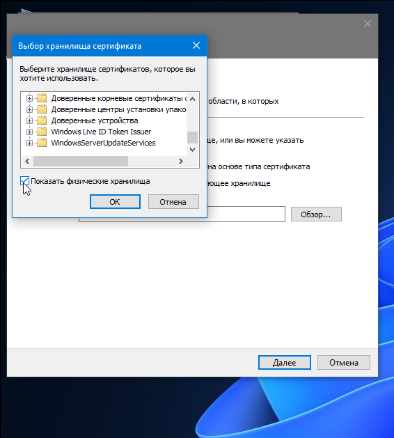

---
## Развертывание системы МОНИТОРИНГА
### 1. Создание корневого сертификата
---
Администрирование/Сертификаты/Корневые центры сертификации

---
В левом верхнем углу нажимаем "Корневой сертификат", заполняем пустые поля, алгоритм подписи должен быть RSA(2048), нажимаем Создать сетрификат

---
созданный корневой сертификат экспортируем на ПК, в нашем примере на рабочий стол, нажимаем далее

---
указываем путь, нажимаем Готово, ОК

---
на рабочем столе появился созданный корневой сертификат, его надо установить в хранилище доверенных корневых сертификатов и центров сертификации

---
устанавливаем

---
переводим в локальный компьютер и нажимаем далее

---
помещаем в указанное хранилище

---
обязательно надо поставить галочку

---
выбираем хранилище

---
раскрываем "Доверительные отношения в предприятии" и переходим в "Реестр" и нажимаем OK

---
по итогу 

---
### 2. Создание персонального сертификата
---
Администрирование/Сертификаты/персональные сертификаты

---
в левом верхнем углу нажимаем на "сертификат" в тип сертификата выбираем "Web-мониторинг" (обратите внимание, что созданный ранее корневой сертификат автоматически подставляется)

---
обратите внимание, корневой сертификат созданный ранне подставляется автоматически. "Создать сетрифиат"

---
сертификат создается на 1 год

---
### 3. Привызываем сертификаты мониторинга к ЦУС
---
Структура. двойным нажатием клавишой мыши открываем ЦУС.

---
В открывшемся окошке заходим в раздел Сертификаты.

---
В разделе серверные сертификаты нажимаем на + и выбираем ранее созданный персональный сертификат mon-aes. В разделе Корневые сертификаты, выбираем корневой сертификат monitoring

---
Далее сохраняем конфигурацию и применяем политику на ЦУС. (все введенные изменения обязательно надо сохранять и применять политику)

---
Далее. Структура. В верхнем правом углу нажимаем на "Мониторинг" (перед этим, закройте МК и перелогинитесь заново. Желательно по умолчанию иметь Google, Yandex, Mozila браузеры)

---
в открывшемся окне, браузер не доверяет сертификату и поэтому вам придется довериться для дальнейшего продолжения работы на этом сайте. авторизуемся под встроенным admin  ЦУС 

---
Система мониторинга комплекса MilliSec NGFW, представляет собой ПО позволяющее проводить мониторинг различных параметров узлов безопасности, входящиз в состав комплекса

---
Интерфейс системы мониторинга выглядит следующим образом:
Раздел «Панель мониторинга»: включает в себя набор настраиваемых виджетов для отображения информации о состоянии объектов;

Раздел «Журналы»: просмотр журналов системы;

Раздел «Статистика: формирование и просмотр настраиваемых отчётов;

Раздел «Структура»: включает в себя настройку шаблонов групп, просмотр событий, сведений о состоянии компонентов узлов безопасности;

Раздел «Настройки»: настройка сервера исходящих почтовых сообщений
В верхней панели присутствует «Счетчик событий»: системные события, события сетевой безопасности и события управления (красный — события высокой важности; оранжевый — события средней важности; зеленый — события низкой важности).
Структура
Раздел предназначен для просмотра сведений о состоянии объектов мониторинга и настройки шаблонов.

В разделе отображаются реальные сведения о функционировании устройств.

Есть следующие группы:

ЦП и память: информация о ЦП и оперативной памяти устройства;

Подсистемы: информация об активированных компонентах устройства;

Жесткие диски: сведения о жестких дисках и состоянии их разделов;

Сетевые интерфейсы: информация о статусе и состоянии интерфейсов;

Активные сетевые и VPN соединения

