## Развертывание МК на Windows
### 1. Подготовка интерфейса
---
задаем IP адрес 192.168.10.100/24 шлюз указываем тот, коротый стоит на ЦУС 192.168.10.10 
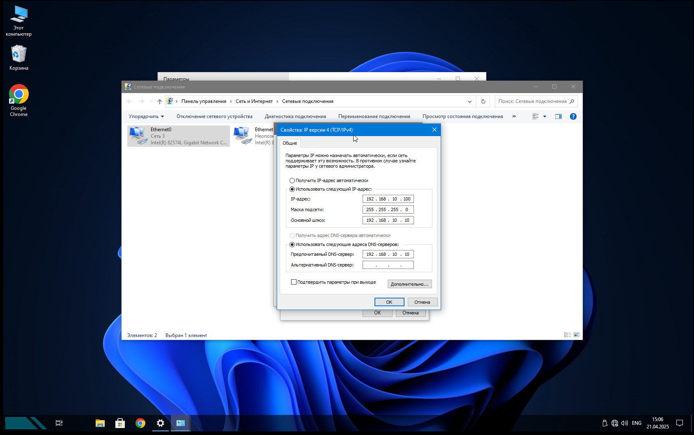
---
### 2. Установка Менеджера конфигурации
Устанавливаем программу МК
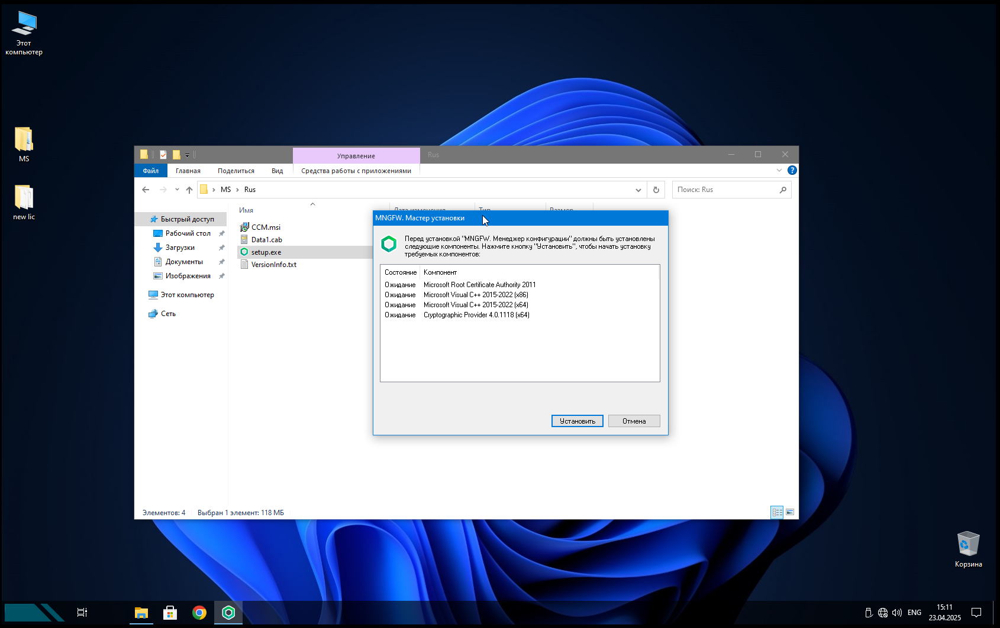
---
Далее
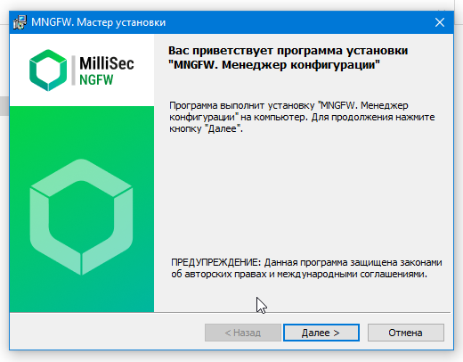
---
принимаем условия и далее
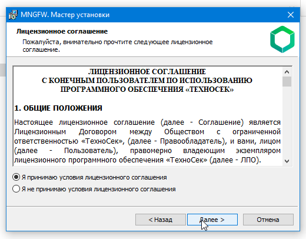
---
далее
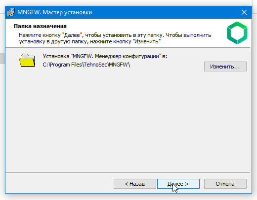
---
готово
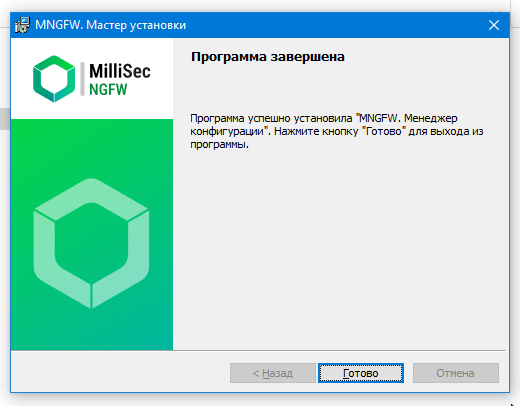
---
после установки прогрммы, система попросит перезагрузку пк. нажмите ДА
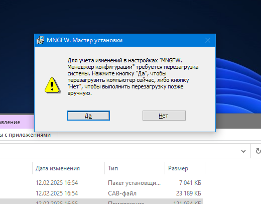
---
### 3. Первый запуск МК.
после перезагрузки системы, на рабочем столе появится иконка "Менеджер конфигурации" открываем его
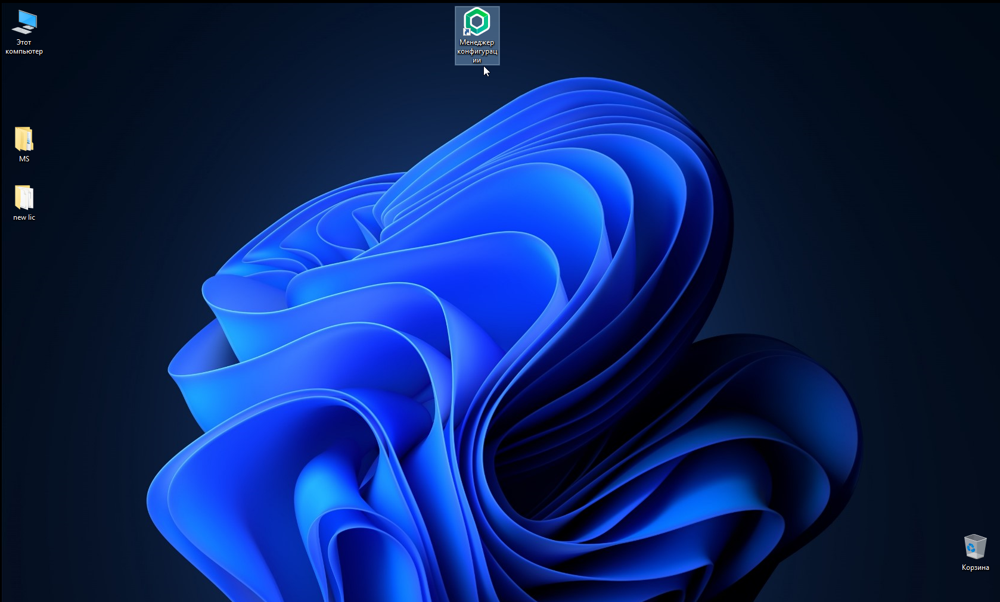
---
при первом открытии программы, нужно будет сгенерировать датчик случайных чисел (ДСЧ), нажимаем на выделенное красным
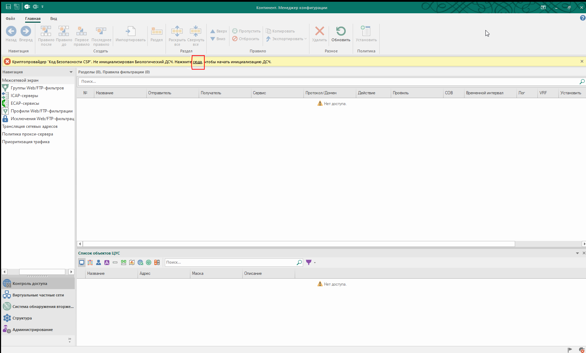
---
после нажатия на экране появится мишень, для накопления ДСЧ надо попадать по середине мишени
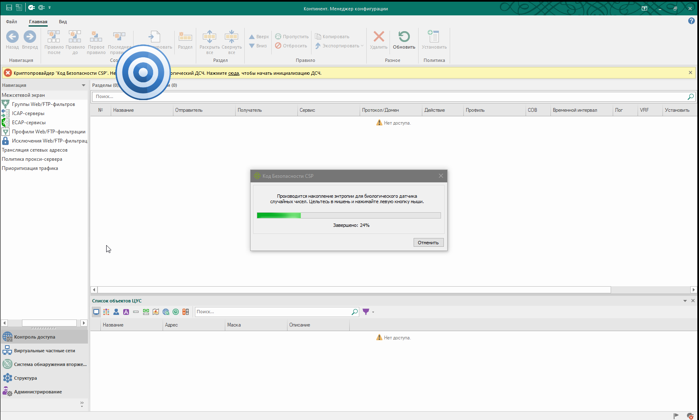
---
после успешного накопления ДСЧ уведомление исчезает. теперь надо установить соединение
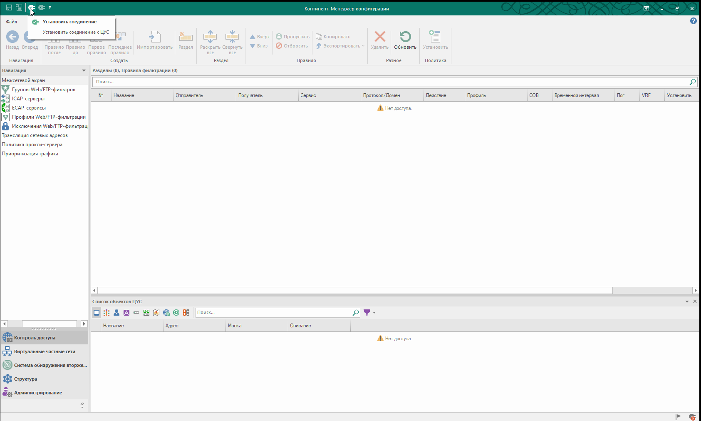
---
заполняем: Cервер:IP адрес ЦУС; учетная запись:встроенного администратора admin; Пароль:от одминистратора ЦУС
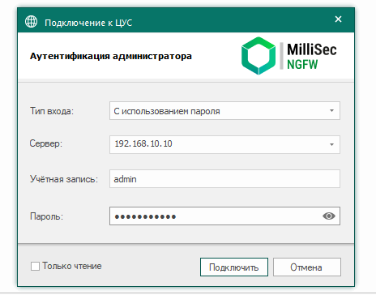
---
при первом подключении к ЦУС выйдет уведомление о неизвествном сертификате, нажимаем доверит
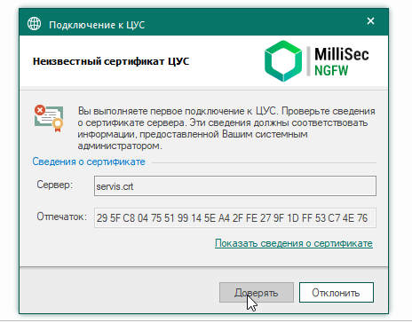
---
### 4. Добавление и привязка лицензии.
в открывшемся окне, заходим в "Администрирование/Лицензии"
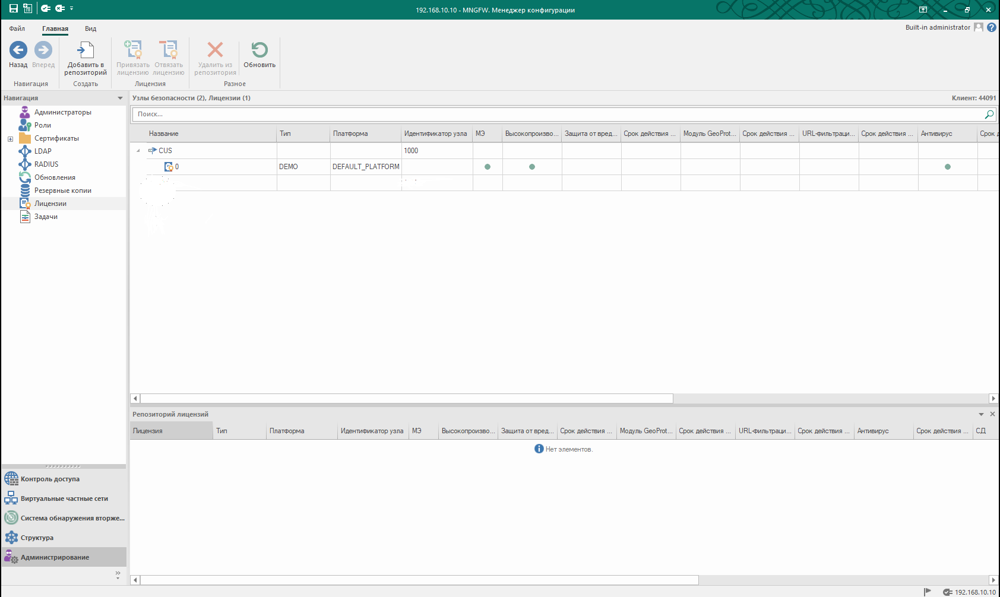
---
отвязываем лицензию которая по дэфолту выдается на 14 дней
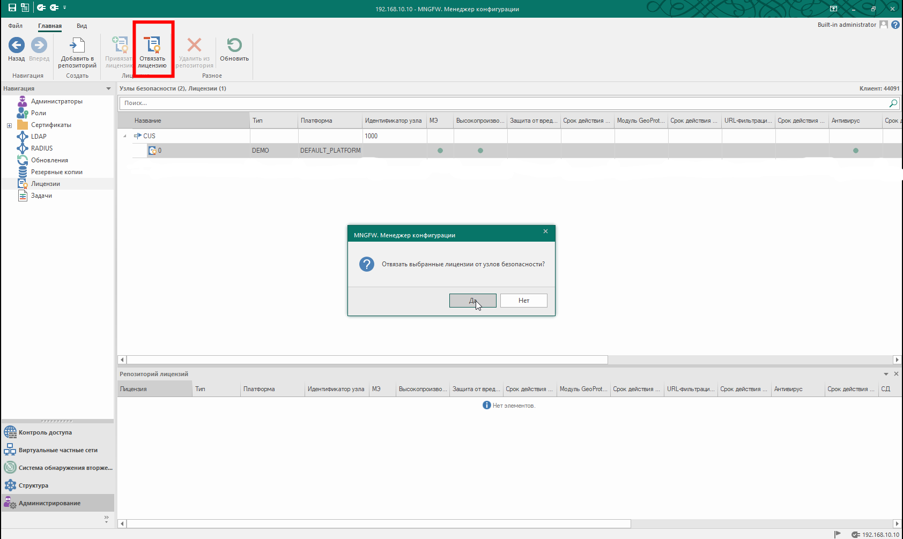
---
добавляем новые лицензии в репозиторий, (каждая лицензия выдается на количество комплекса)
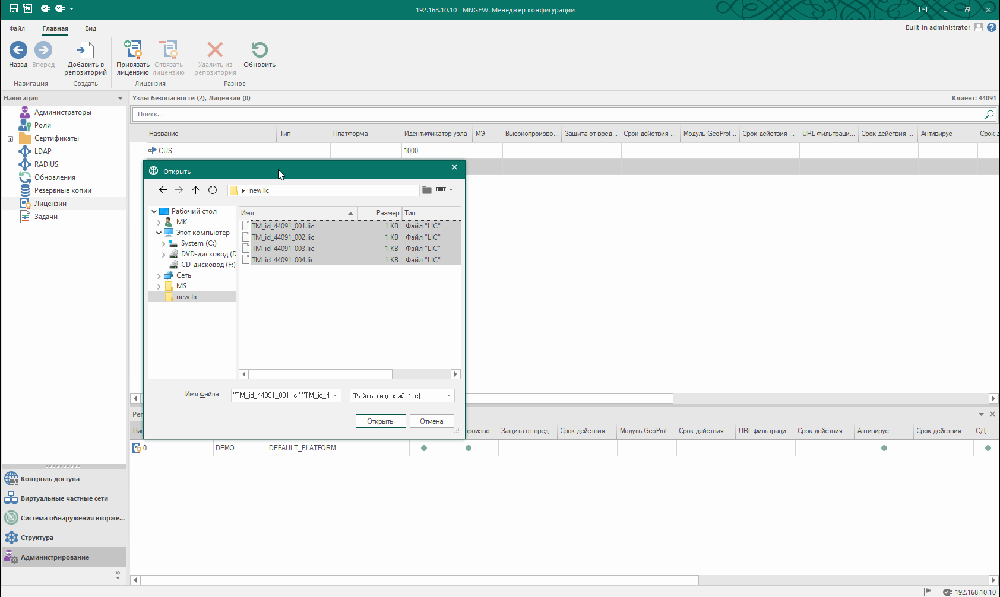
---
после добавления лицензии они отображаются внизу с инфрмацией (срок действия, защита от вредоностных атак и т.д)
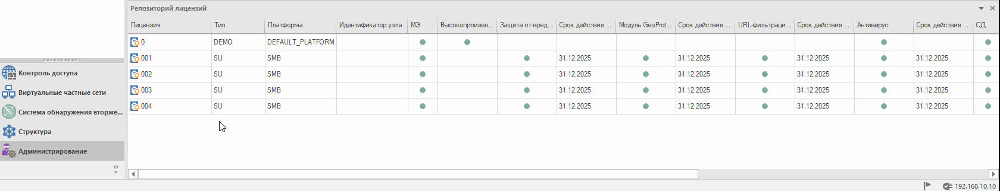
---
теперь привязываем лицензия к ЦУС:для этого, нажимаем на CUS, выбираем из репозитории одну из ранее добавленных лицензии
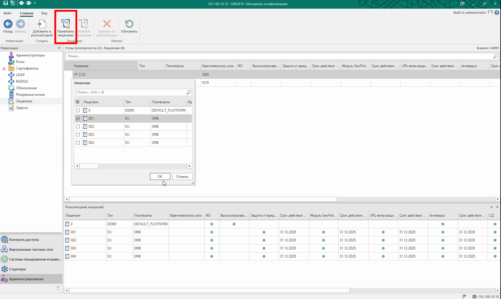
---
сохраняем конфигурацию Ctrl+S 
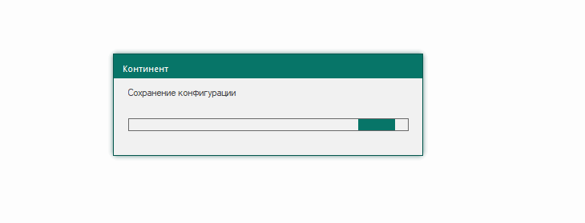
---
устанавливаем политику на ЦУС Ctrl+I
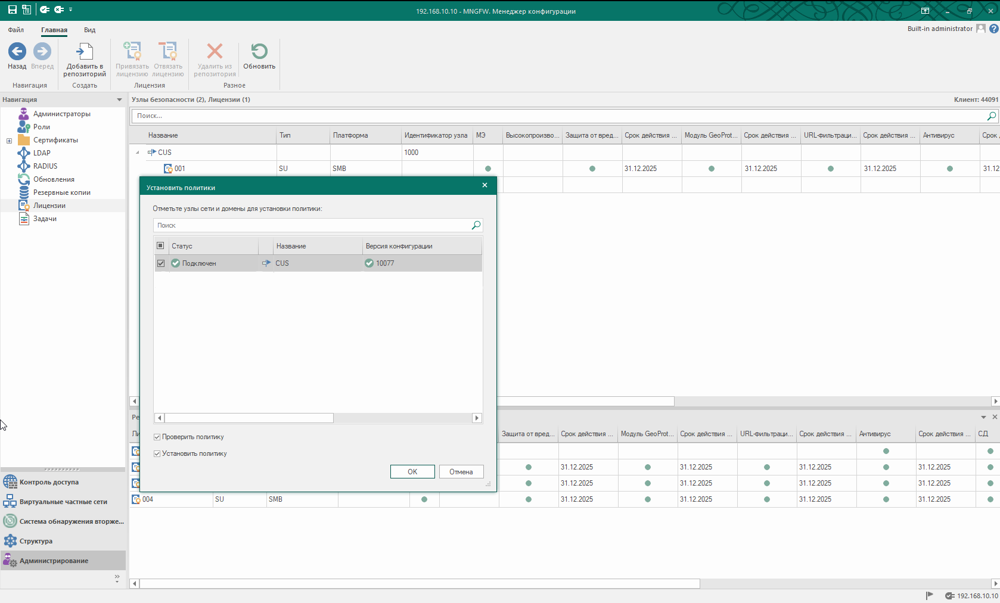
---
дождаться завершения задачи до 100%
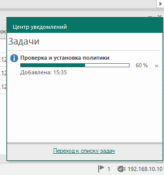
---
после открываем "Структура" и удостоверяемся в наличии версии и установленной лицензии
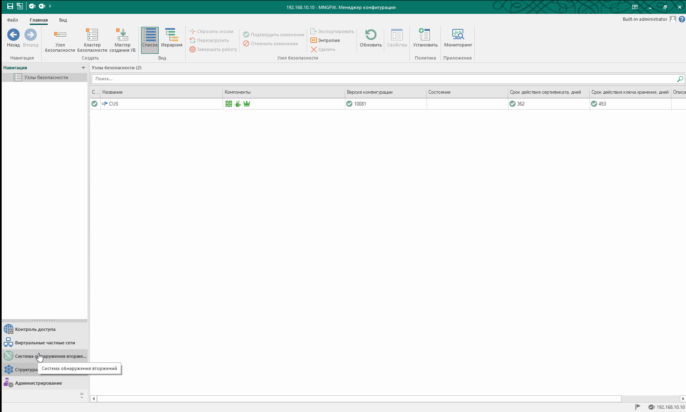
